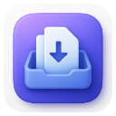
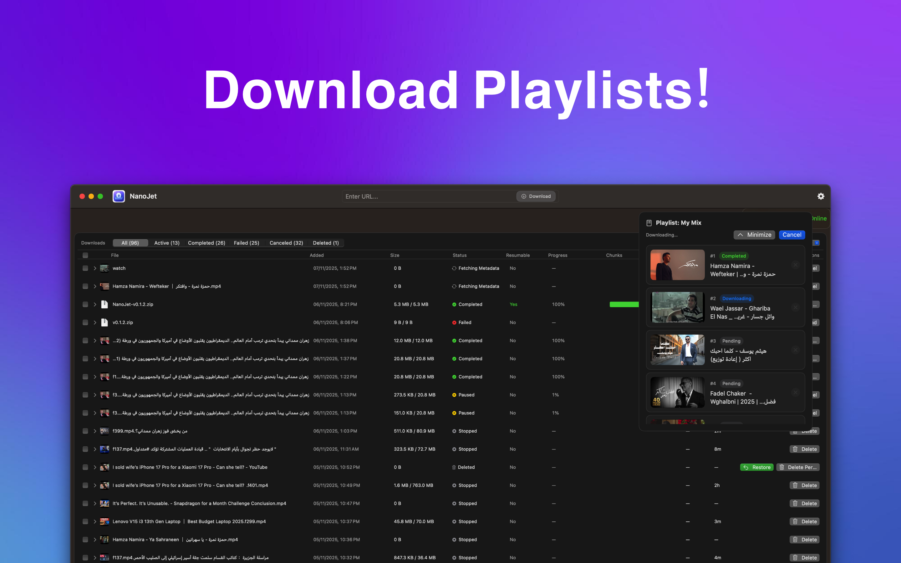
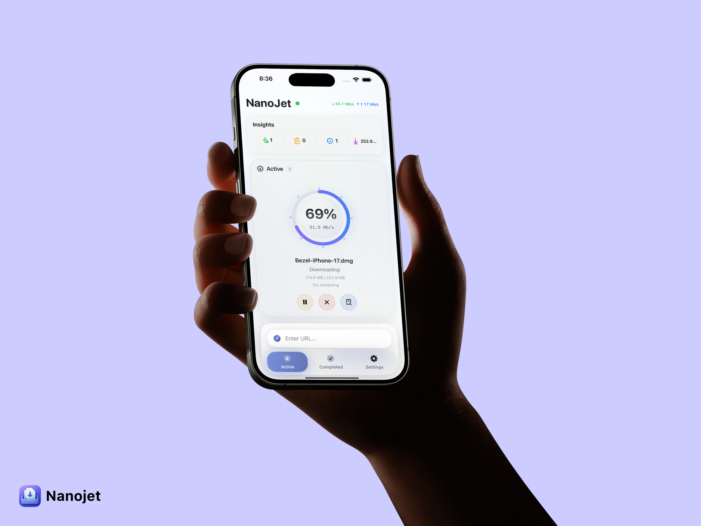

<p align="center">
  
</p>

<h1 align="center">NanoJet</h1>

<p align="center">
  <strong>⚡ Fast & Lightweight Download Manager for macOS & iOS</strong>
</p>

<p align="center">
  <a href="https://apps.apple.com/us/app/nanojet-save-organize-files/id6754451655">
    
  </a>
  <a href="https://github.com/ahmedsam007/NanoJet-releases/releases/latest">
    
  </a>
  <a href="https://chromewebstore.google.com/detail/nanojet-interceptor/lcifecfkpdceaccnbbphhnfmpdlnkipn">
    
  </a>
</p>

<p align="center">
  <a href="https://nanojet.app">🌐 Website</a> •
  <a href="#features">Features</a> •
  <a href="#download">Download</a> •
  <a href="#whats-new">What's New</a> •
  <a href="#installation">Installation</a>
</p>

---

## 📱 Screenshots

<p align="center">
  
</p>

<p align="center">
  
</p>

---

## ✨ Features

### 🚀 Blazing Fast Downloads
- **Segmented multi-connection downloads** - Split files into multiple parts for maximum speed
- **Resume capability** - Pause and resume downloads anytime
- **Auto-reconnect** - Automatically recovers from network issues

### 📊 Smart Management
- **Real-time progress tracking** - Speed, ETA, and percentage at a glance
- **Download scheduler** - Schedule downloads for later
- **Download history** - Keep track of all your downloads
- **File integrity verification** - SHA-256 checksum validation

### 🌐 Browser Integration
- **Chrome Extension** - Automatically capture downloads from your browser
- **Firefox Extension** - Full extension support
- **URL scheme support** - Open downloads directly from other apps

### 📹 Media Downloads
- **YouTube video support** - Download videos via yt-dlp integration
- **Playlist support** - Download entire playlists at once
- **Quality selection** - Choose your preferred video quality

### 📱 iOS Exclusive Features
- **Internet Speed Widget** - Monitor your connection speed on your Home Screen
- **Lock Screen Widget** - Check speeds without unlocking
- **Biometric Lock** - Secure your downloads with Face ID or Touch ID
- **Share Extension** - Download files directly from Safari and other apps

### 🖥️ macOS Exclusive Features
- **Menu Bar Extra** - Quick access from your menu bar
- **Archive extraction** - Built-in support for ZIP, RAR, and more
- **Sparkle updates** - Automatic updates for non-App Store versions

---

## 📥 Download

### iOS (iPhone & iPad)

<a href="https://apps.apple.com/us/app/nanojet-save-organize-files/id6754451655">
  
</a>

**Requirements:** iOS 16.0 or later

---

### macOS

#### Option 1: Mac App Store (Recommended)
The App Store version receives automatic updates and is fully notarized.

#### Option 2: Direct Download
Download the latest version directly from GitHub:

👉 **[Download NanoJet for macOS](https://github.com/ahmedsam007/NanoJet-releases/releases/latest)**

| Version | Release Date | Download |
|---------|-------------|----------|
| v0.1.4 | January 2026 | [Download](https://github.com/ahmedsam007/NanoJet-releases/releases/tag/v0.1.4) |
| v0.2.0 | October 2025 | [Download](https://github.com/ahmedsam007/NanoJet-releases/releases/tag/v0.2.0) |

**Requirements:** macOS 13.0 (Ventura) or later

---

### Chrome Extension

Capture downloads automatically from your browser:

<a href="https://chromewebstore.google.com/detail/nanojet-interceptor/lcifecfkpdceaccnbbphhnfmpdlnkipn">
  
</a>

---

## 🆕 What's New

### iOS v0.1.2
*January 2026*

- 📶 **Internet Speed Widget Fix** - Widget now updates correctly when there's no internet connection
- 🔄 **Refresh Button** - Added refresh button to the Internet Speed Widget for manual updates
- ⚡ **UI Performance** - Enhanced UI performance by removing unnecessary shadows
- ⭐ **Rate Us Screen** - New rate us screen to share your feedback
- 🔗 **Updated Links** - Updated contact emails and website links

### macOS v0.1.4
*January 2026*

- 🐛 Bug fixes and stability improvements
- 📦 App Store release

### Previous Releases

<details>
<summary><strong>macOS v0.2.0</strong> - Critical Bug Fixes</summary>

- 🔧 **Fixed file corruption on pause/resume** - Files no longer become corrupted when pausing and resuming
- 🔧 **Fixed network loss recovery** - Downloads interrupted by network issues complete correctly
- 🔧 **Fixed progress display** - UI now shows accurate progress instead of stuck at 0%
- ✨ **Better error messages** - Clear explanations when downloads fail
- ✨ **File integrity validation** - Automatic size validation before finalizing

</details>

<details>
<summary><strong>macOS v0.1.1</strong> - Re-download Feature</summary>

- ✨ Added "Re-Download File" feature for completed downloads
- 🔄 Added retry functionality for failed downloads
- 🎯 Fixed Progress column header alignment
- 💡 Improved UX with clear action buttons

</details>

<details>
<summary><strong>macOS v0.1.0</strong> - Initial Release</summary>

- 🚀 Initial release with segmented downloads
- ⏸️ Pause, resume, and cancel downloads
- ✅ SHA-256 file integrity verification
- 📊 Real-time speed and ETA tracking
- 🌐 Chrome & Firefox extension integration
- 📥 YouTube video download support
- ⏰ Download scheduling
- 🔔 Completion notifications

</details>

---

## 📲 Installation

### macOS (Direct Download)

1. **Download** the latest `.zip` file from [Releases](https://github.com/ahmedsam007/NanoJet-releases/releases/latest)
2. **Extract** the zip file
3. **Move** `NanoJet.app` to your Applications folder
4. **First Launch:**
   - Right-click the app and select **"Open"**
   - Click **"Open"** in the security dialog
   - The app will now be trusted for future launches

> ⚠️ **If you see "App is damaged":**
> Run this command in Terminal:
> ```bash
> xattr -cr /Applications/NanoJet.app
> ```

### iOS

Simply download from the [App Store](https://apps.apple.com/us/app/nanojet-save-organize-files/id6754451655) - no additional steps required!

---

## 🔒 Privacy & Security

- **No data collection** - We don't collect any personal data
- **Local storage** - All downloads are stored locally on your device
- **No analytics** - No tracking or analytics
- **Secure downloads** - HTTPS support and file integrity verification

---

## 📋 System Requirements

| Platform | Minimum Version |
|----------|----------------|
| macOS | 13.0 (Ventura) |
| iOS | 16.0 |
| watchOS | 9.0 (for Apple Watch) |

---

## 🌍 Languages

NanoJet is available in:
- 🇺🇸 English
- 🇸🇦 العربية (Arabic)
- 🇫🇷 Français
- 🇪🇸 Español
- 🇩🇪 Deutsch
- 🇮🇹 Italiano
- 🇧🇷 Português (Brasil)
- 🇨🇳 简体中文
- 🇯🇵 日本語
- 🇰🇷 한국어

---

## 📞 Support

- 🌐 **Website:** [nanojet.app](https://nanojet.app)
- 🐛 **Report Issues:** [GitHub Issues](https://github.com/ahmedsam007/NanoJet-releases/issues)

---

## 📄 License

See the [LICENSE](LICENSE) file for details.

---

<p align="center">
  Made with ❤️ by Ahmed Sam
</p>

<p align="center">
  <a href="https://nanojet.app">nanojet.app</a>
</p>
